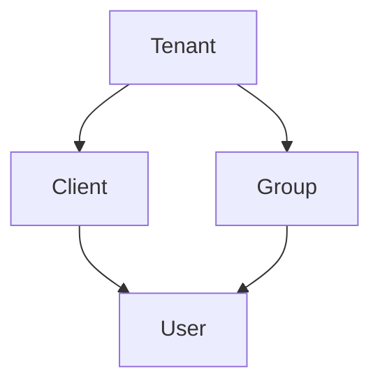

# Match Making API

A team-vs-team matchmaking system built with Domain-Driven Design principles, providing robust scheduling, conflict detection, and game management capabilities.

## Tenacity Scheme

## Domain-Driven Design for a Team-vs-Team Matchmaking System

### Bounded Contexts

**1. Matchmaking (Pairing Domain)**
* **Core Responsibilities:**
   - Managing player and team queues (Pools)
   - Applying matchmaking algorithms to pair suitable teams based on schedule compatibility
   - Creating and managing matches (Pairs)
   - Automatic conflict detection and verification
   - Handling matchmaking preferences and constraints
* **Key Features:**
   - Schedule-based matching with conflict detection
   - Automatic conflict flagging and notification system
   - Admin conflict resolution capabilities
   - Manual invitation management system (create, update, revoke, accept, decline)
   - Performance-optimized matching with caching and parallel processing
* **Upstream:**
   - Game Server: Receives match details and player information
   - Player Profile Service: Fetches player data (skill rating, preferences, etc.)
* **Downstream:**
   - Game Server: Sends match details to initiate the game
   - Player Profile Service: Updates player statistics and preferences after matches

**2. Game Management**
* **Core Responsibilities:**
   - Managing available games for matchmaking
   - Managing game modes and regions
   - Validating game configurations
* **Key Features:**
   - CRUD operations for games, game modes, and regions
   - RESTful API endpoints with OpenAPI documentation
   - MongoDB integration for persistence

**3. Schedules Domain**
* **Core Responsibilities:**
   - Managing player and party availability schedules
   - Handling schedule constraints
   - Appointment management
* **Key Features:**
   - Flexible schedule configuration with timeframes
   - Schedule compatibility checking
   - Appointment creation and management

### Domain Entities and Responsibilities

**Matchmaking (Pairing) Domain:**

* **Pool:** √
   - A subset of players or teams within a lobby, filtered by specific criteria
   - Manages party queues with FIFO ordering
   - Supports concurrent access with mutex-based synchronization

* **Pair:** √
   - Represents a group of teams matched for a game
   - Stores information about matched teams, conflict status, and metadata
   - Tracks conflict status (None, Flagged, Resolved) for schedule conflict management

* **Inquiry:** √
   - A request from a player or team to be matched
   - Includes preferences and constraints

* **Commitment:** √
   - A player or team's commitment to a specific match
   - Handles match acceptance or decline

* **Invitation:** √
   - Manual invitations created by administrators for users to join matches or events
   - Supports status tracking (Pending, Accepted, Declined, Expired, Revoked)
   - Includes expiration date management and notification integration
   - Allows administrators to create, update, and revoke invitations
   - Enables users to accept or decline invitations with proper ownership validation

* **Notification:** √
   - Messages sent to players or teams about match-related information
   - Supports conflict notifications and match updates
   - Supports invitation-related notifications (created, accepted, declined, revoked)

**Parties Domain:**

* **Party:** √
   - A group of players who queue together as a team
   - Base entity for team formation

* **Peer:** √
   - An individual player within a party
   - Represents single player entities

**Schedules Domain:**

* **Schedule:** √
   - Defines availability and constraints for parties or peers
   - Supports flexible date options (months, weekdays, days, timeframes)
   - Two types: Availability and Constraint

* **Appointment:** √
   - A specific match scheduled for a particular time and duration
   - Links parties and peers to scheduled matches

* **Availability:** √
   - The times when a player or team is available to play
   - Used for schedule compatibility checking

* **Constraint:** √
   - Limitations or restrictions on availability or preferences
   - Used to filter matchmaking options

**Lobbies Domain:**

* **Lobby:** 
   - Represents game lobbies with region support
   - Links to game entities and regions

**Game Domain:**

* **Game:** √
   - Game configuration with team settings, match settings, and matchmaking preferences
   - Supports multiple game modes and regions

* **GameMode:** √
   - Specific game mode configurations

* **Region:** √
   - Geographic or logical regions for matchmaking
